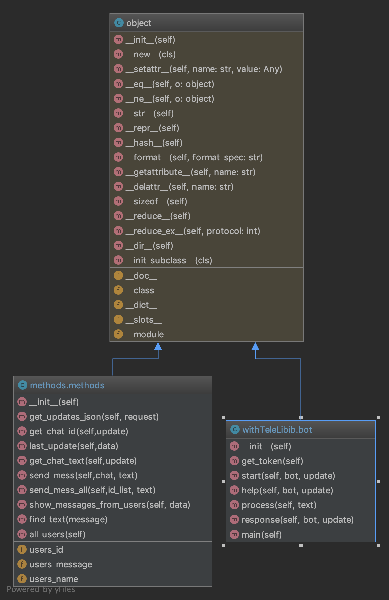

Скачан второй курс ГИ
## feature list:
### 1. Send bot a question from any online-test
#### two ways to answer:
#### A. using database - just search throught dataFromVSP folder and send the answer
#### B. give with question an literature as lections conspects and 4 variants of answers
#### the bot will search max question match in conspect and will return one answer. accurasitu is 87%

## authors:
### Isaev Vasily - model training to answer when not exist in database
### Kulikov Nikita - develop bot logic with python
### Ivanov Ilya - create database of answers, load it from other source and prepare for bot
### Betuganov Adam - deploy and documentation

## Class Diagram

